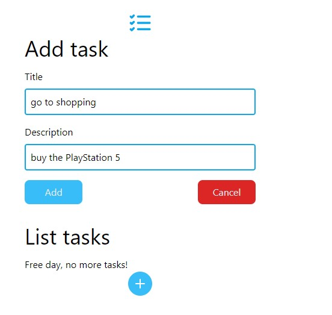
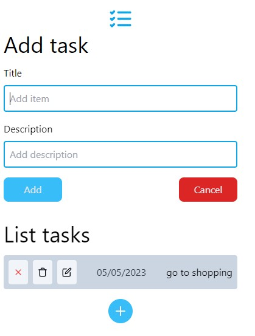
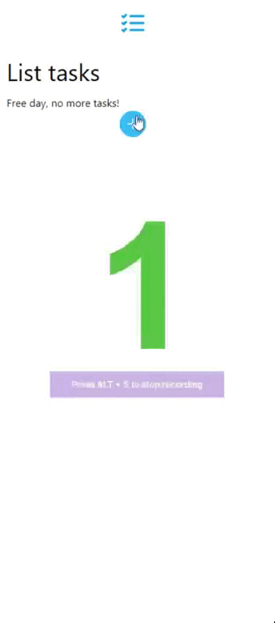

# To-do List react.js ok ✅

#### By: Roni Athayde 👨‍💻

## Vizualize o projeto em tempo real aqui!:
_em-andamento-aguarde..._ 🔧

### Imagens do projeto:
Seção para adição de tasks ( sem nenhuma task )

Seção para adição de tasks ( com uma task não marcada )

Seção de editar task

Uma task marcada

Interação

## Tecnologias utilizadas:
* react.js ( js )🤖
* tailwind ( css ) 🎨

## Conceitos utilizados em react.js
* useState - Hook
* useContext - Hook
* props

## Como testar o projeto localmente?

Para iniciar o projeto na sua máquina basta que use o comando:

#### `git clone https://github.com/roniathayde/todolist-react.git`

Assim que o projeto for clonado, abra a pasta que contém os arquivo do projeto com o comando:

#### `cd todolist-react`

Agora basta que nós baixemos as dependências do projeto que estão contiadas no package.json com o comando:

#### `npm i` ou `npm install`

Com o projeto instalado localmente agora é só inicia-lo com o comando:

#### `npm start`

Seu projeto react está rodando 🎉😆