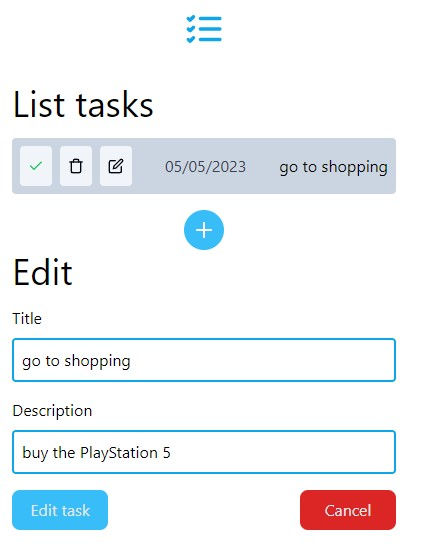
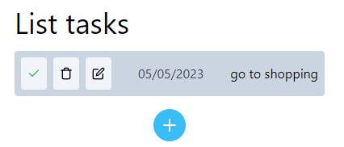

# To-do List react.js ok ✅

#### By: Roni Athayde 👨‍💻

## View the project in real time here!:
_in-progress-wait..._ 🔧

### project images:

Section for adding tasks (without any tasks)

Section for adding tasks (with an unmarked task)

Edit task section

A scheduled task

Interaction

## Technologies used:
* react.js ( js )🤖
* tailwind ( css ) 🎨

## Concepts used in react.js
* useState - Hook
* useContext - Hook
* props

## How to test the project locally?

To start the project on your machine just use the command:

#### `git clone https://github.com/roniathayde/todolist-react.git`

Once the project is cloned, open the folder containing the project files with the command:

#### `cd todolist-react`

Now all we have to do is download the project's dependencies that are contained in package.json with the command:

#### `npm i` ou `npm install`

With the project installed locally, now just start it with the command:

#### `npm start`

Your react project is running 🎉😆

#### Attention ⚠️: if you have anything that can help me with this project, please do not hesitate to contact me!

Email 📩 : pontes014@gmail.com
